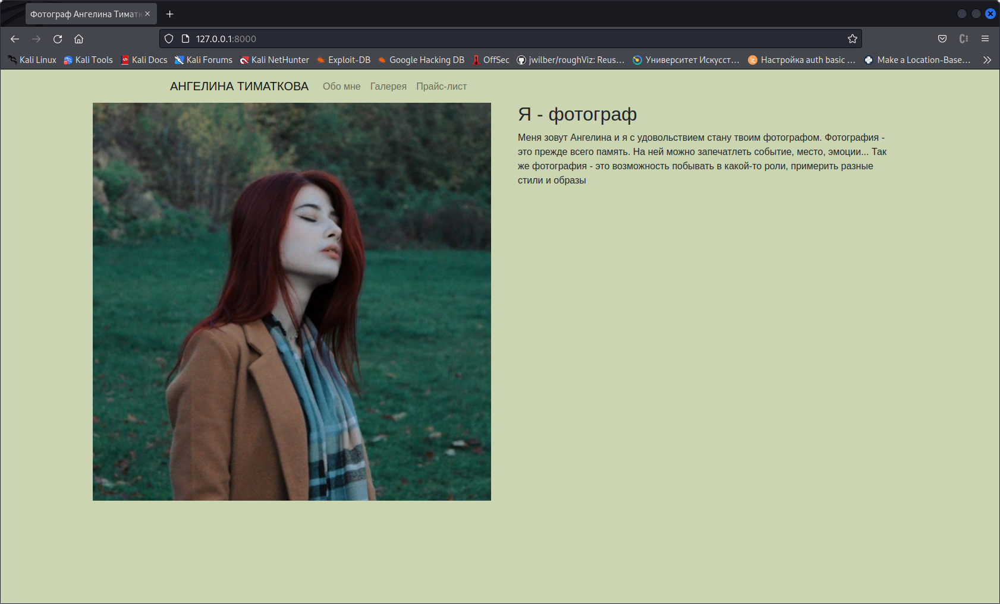
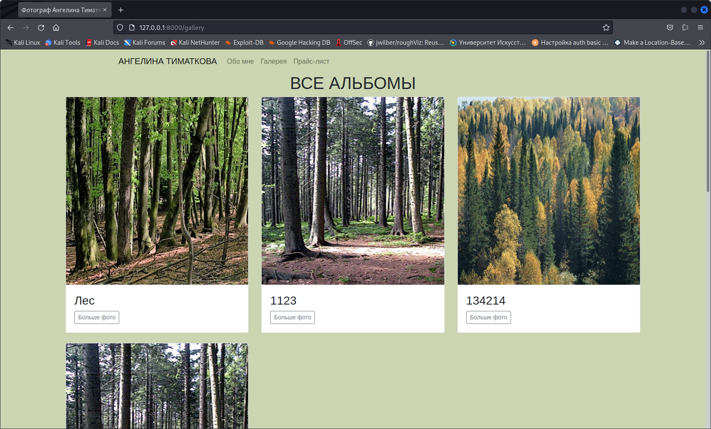
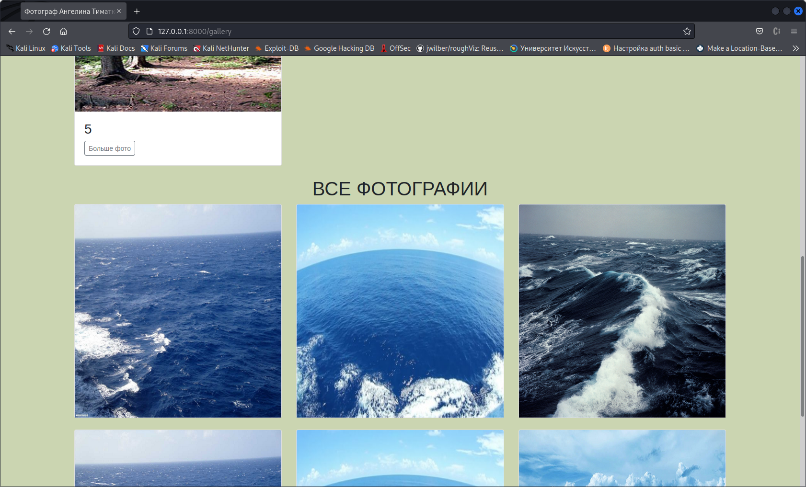
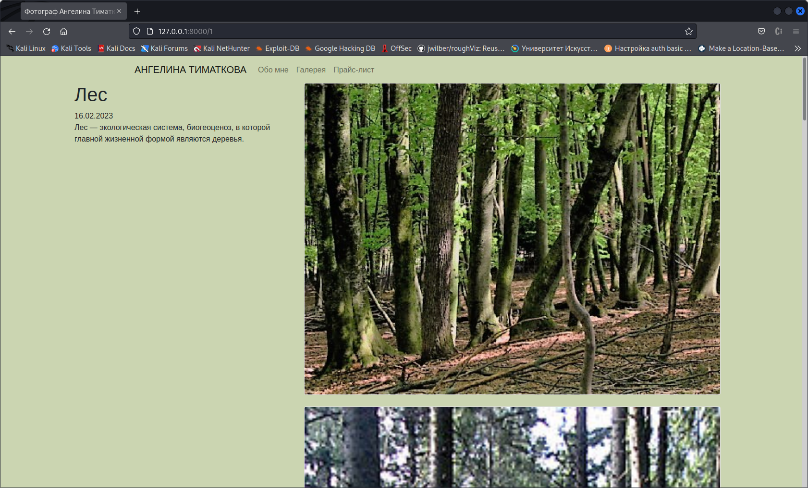
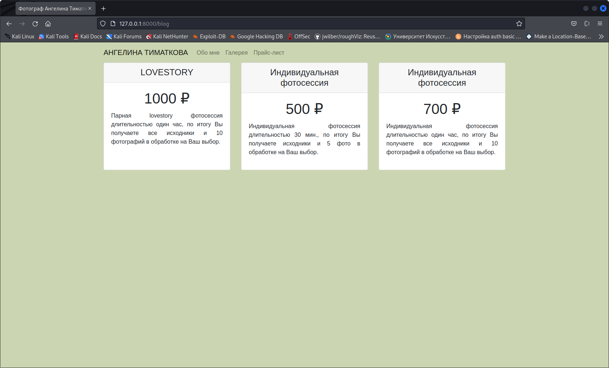

# Сайт фотографа
<h2>Описание</h2>

Данный сайт можно использовать, как сай-портфолио. Backend данного проекта сделан на Django.

 
Для посетителя предусмотрены 3 вкладки:
<ul>
  <li>Обо мне
  
  </li>
  <li>Галерея
    На ней располагаются два блока
    <ul>
       <li>
    Все альбомы
  
  </li>
  <li>
  Все Фотографии
  
  </li>
  <li>
  Детальная страница альбома
  
  </li>
  </ul>
  </li>
  <li>Прайс-лист
  
  </li>
</ul>
Также в данном проекте настроена админка Django для администрирования веб-сайта. Интерфейс адаптирован на мобильное разрешение.
