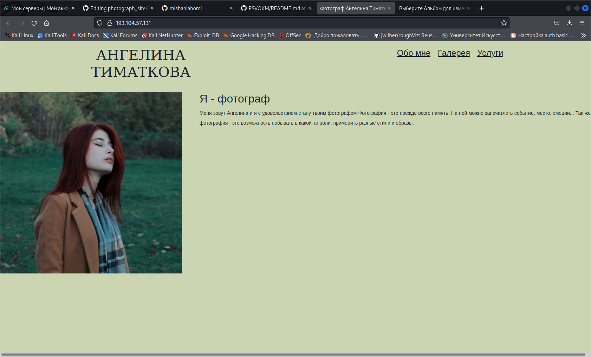
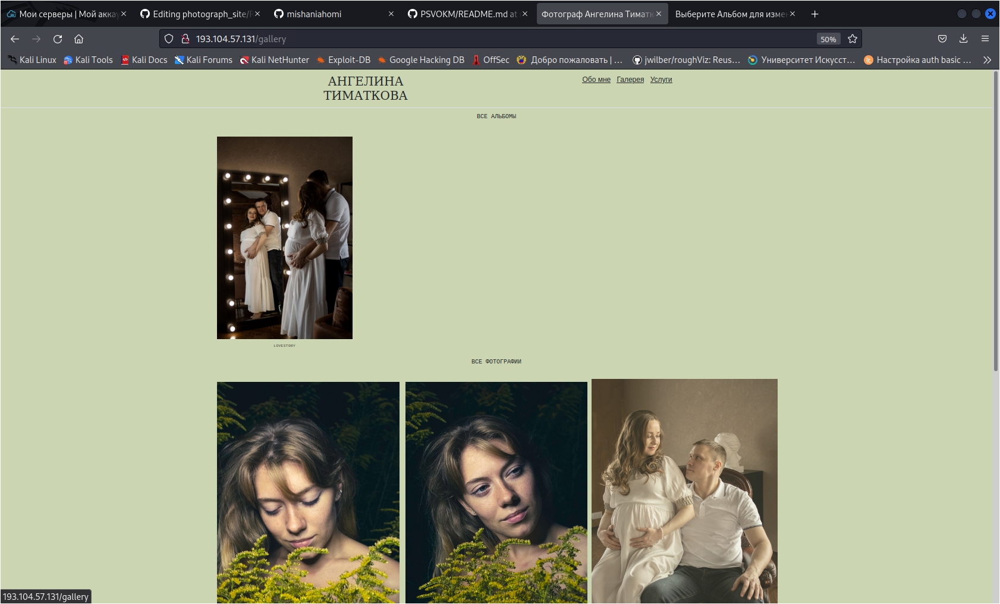
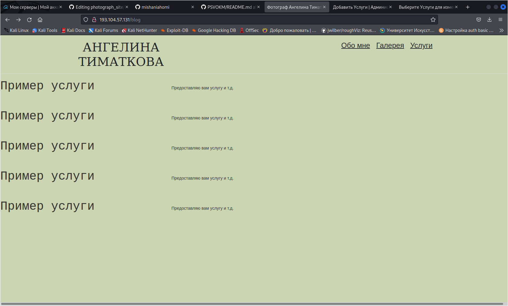
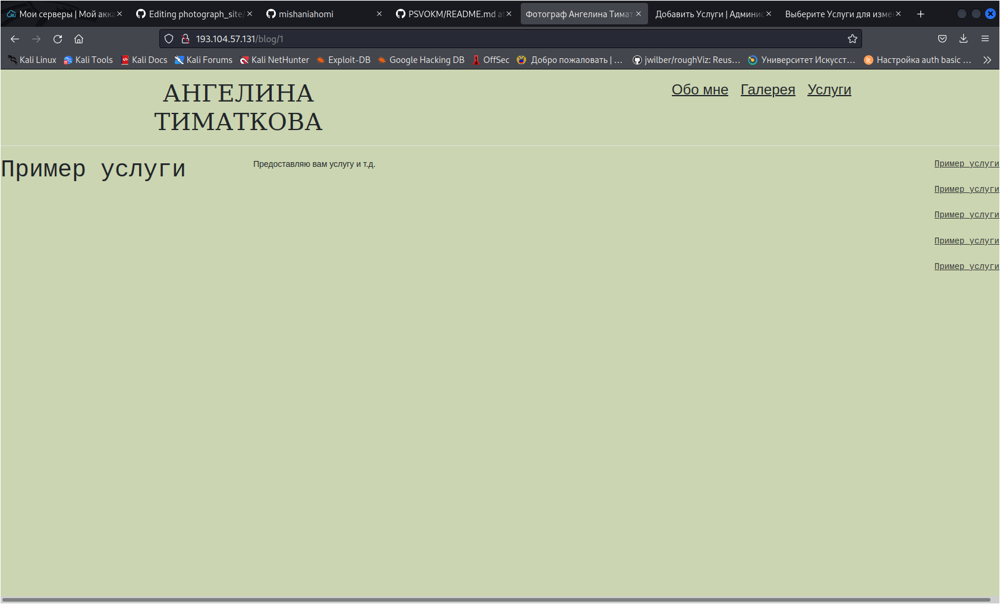

<h1>Сайт фотографа</h1>
<h2>Описание</h2>

Данный сайт можно использовать, как сай-портфолио. Backend данного проекта сделан на Django.

 
Для посетителя предусмотрены 3 вкладки:
<ul>
  <li>Обо мне</li>
  <li>Галерея</li>
  <li>Услуги</li>
</ul>

Также имеется более детальное описание услуги:

Также в данном проекте настроена админка Django для администрирования веб-сайта.
